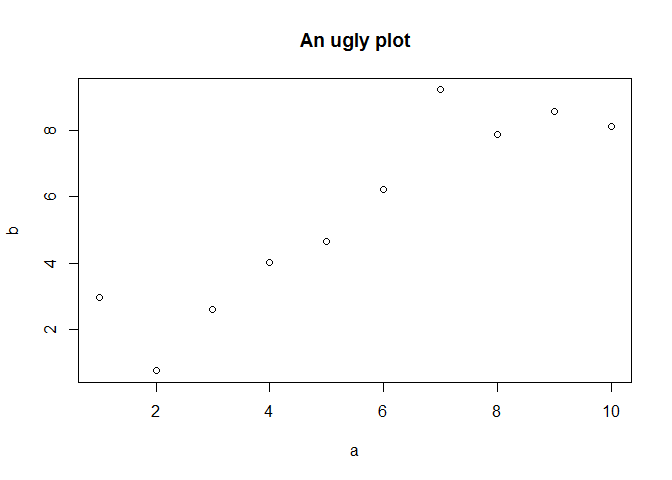

**Why R?**

-   Free of charge (though paid support options are available).
-   Open source and extensible.
-   Over 10,000 available libraries for all kinds of specialized tasks.
-   Very popular *programming language* for statistics. “It promotes
    experimentation and exploration, which improves data analysis.”
-   Great for visualization. Excellent packages for graphics.
-   A very active and helpful community.
-   Very flexible: Good support for metaprogramming, first class
    functions, first-class environments.
-   Supports array-based programming.

**What is R anyway?**

If you are coming from SAS or Stata, you are better off thinking about
it as a programming language and not as a statistical environment:

-   Interpreted: Slower execution than compiled languages but
    potentially faster development time (immediate feedback, no
    compilation step).
-   Dynamically typed: Data types are associated with values, not
    variables. Type checking occurs on as as-needed basis at runtime.
    Harder to identify bugs but makes metaprogramming easier, less
    “language bureaucracy.”
-   Multi-paradigm: Supports different styles of programming:
    functional, imperative, object-oriented, array, procedural,
    reflective.
-   Interactive or batched: May run scripts and/or enter commands
    through a command prompt (REPL). Interactive programming useful for
    experimentation and debugging.

The extension of the R files is usually `.R`. This is merely a common
convention (R doesn’t care what extension is used).

**SAS vs. R**

Some advantages of SAS:

-   Centralized support.
-   Easier to work with data sets that do not fit in main memory. R
    requires special packages for this; these packages are not
    well-integrated with the rest of R.
-   Quality of documentation is more consistent.
-   More consistent naming conventions.
-   Better integration with SQL.
-   Better default logging behavior.

Some advantages of R:

-   Free.
-   Open source. You may inspect and modify anything you wish.
-   More available methods (10,000+ packages).
-   New methods are almost always released in R first. If you want the
    cutting edge, use R.
-   Superior graphing libraries.
-   Matrix operations supported by both languages but better integrated
    in R.
-   Resembles other languages (e.g., Python, Matlab)…easier to transfer
    skills.
-   More flexible/extensible. Writing highly customized code is easy &
    intuitive.
-   Faster market growth. Academia shifting to R.
-   The only common tongue between statisticians & data scientists.

Other differences:

-   SAS is split into many sub-languages: DATA step, PROCs, macros, IML,
    SCL, etc. R is more uniform: processing of all kinds is handled by
    function (procedure) application.
-   SAS: Individual procedures often heavyweight, covering many uses. R:
    Procedures (called “functions” in R lingo) are often more
    specialized.
-   SAS: Generally verbose output. R: Generally terse output. If you
    want something, you have to ask for it.
-   R is more free-form, resembling more traditional programming
    languages.

**RStudio**

R can be downloaded from the Comprehensive R Archive Network,
[CRAN](https//cran.r-project.org). We will be using RStudio, a popular
IDE. It is important to keep in mind that R (the language) and RStudio
(the GUI) are separate things, and it is entirely possible to use
different workflows with other tools or text editors:

-   `emacs` through [ESS](http://ess.r-project.org/).
-   `vim` with the
    [Vim-R-Plugin](http://www.vim.org/scripts/script.php?script_id=2628).
-   Sublime Text.
-   Scite.
-   Notepad++.

**A few useful resources**

There is a constantly growing collection of materials available offline
and online to learn R. The [Journal of Statistical
Software](http://www.jstatsoft.org/index) and the [Use
R!](http://www.springer.com/series/6991) series from Springer regularly
publish applications of R to different domains.

A good overview for beginners is [Learning
R](http://shop.oreilly.com/product/0636920028352.do).

SAS users may find useful [R for SAS and SPSS
users](http://www.springer.com/us/book/9781461406846), although I have
never used it myself.

For the analysis of compley survey data, you may want to take a look to
[“Complex Surveys. A Guide to Analysis Using
R”](http://r-survey.r-forge.r-project.org/svybook/).

The official documentation in CRAN (The Comprehensive R Archive Network)
is available to read but goes well beyond the scope of this class.

**Looking around**

RStudio offers four basic windows.

-   Console (R interpreter)
-   Code, where we will write our code.
-   History/Environment
-   Plots/Packages/Help

**Getting help**

Documentation in R can be accessed through the interpreter. For
instance, if we wanted to get information about what `lm` does, or what
paramaters it takes or some examples of usage, we would type:

    ?lm

To search for a topic, one can type:

    ??"nonlinear regression"
    help.search("nonlinear regression") # alternative syntax

Note that the above only searches through installed packages. Better
search method: Google. ;)

The R community is very helpful and active. If you ever get stuck in a
problem, the best solution is to ask in
[StackOverflow](http://stackoverflow.com/), a very large community of
programmers using the `#r` tag.

Like other single-letter languages, R can be tricky to Google. Try: “R
programming,” “R statistics.”

Within Westat, there is a growing community of users and we have a
number of resources for Q&A and sharing information or announcements.

**About this document**

We (Gonzalo & I…mostly Gonzalo) have prepared these materials using
using [Rmarkdown](http://rmarkdown.rstudio.com/), a format that makes it
easy to create dynamic documents. The text is written in markdown, an
easy markup language (“easy-to-read, easy-to-write”): `_italic_`,
`**bold**`, … but it also allows to include chunks of executable R code.
It simplifies reproducibility and it is very easy to share.

For instance,

is rendered as:

    N <- 10
    a <- 1:N
    b <- a + rnorm(N)
    plot(a, b); title("An ugly plot")

These course notes are a slightly modified version of notes created by
Westat data scientist, Gonzalo Rivero.
