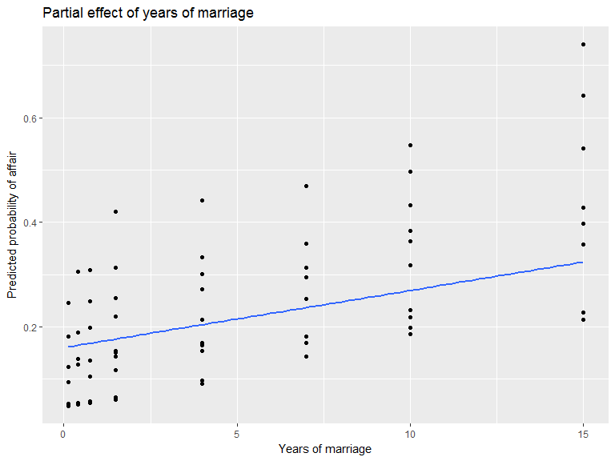
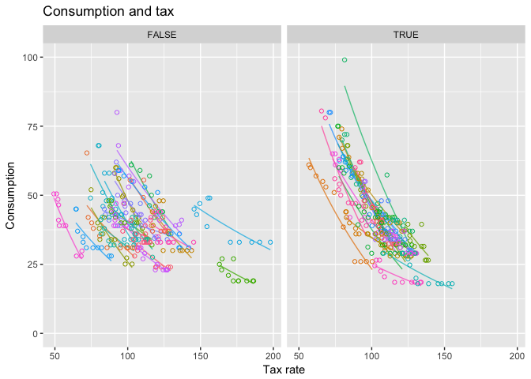

Figures using ggplot2
================
October 27, 2017

The graphical toolbox in R is particularly impressive. I very much like the default plotting library that ships with R: it is clear, simple, and you can build pretty much any figure you can imagine, because it allows to add and manipulate every single element of the figure. However, its flexibility comes at a cost, and figures usually require a lot of work. The `ggplot2`, which implements the "grammar of graphics" approach to building data visualization, has rightfully gained a great deal of popularity, and it is the library that we will use here.

It is also a good opportunity to look at importing new functionality into R.

We first need to install the library using:

``` r
install.packages("ggplot2")
```

The function will hit a CRAN mirror, download the file for the package that we want, and perform the installation routine (which includes a number of checks). Now the package is available in our system, we can load it into our session:

``` r
library(ggplot2)
```

Let's take a dataset:

``` r
tobacco <- read.csv("http://koaning.io/theme/data/cigarette.csv")
```

The structure of a figure in ggplot2 is simple. We first define the data.frame that we will be using, the basic aesthetics for the figure (which variables go to which axis, whether the the dataset is grouped). We use the `ggplot` function for that. Then, we add the different layers of the figure that correspond to the different elements of ghe graph.

For instance, to define a density plot, all we need is one variable living in a dataset:

``` r
p <- ggplot(tobacco, aes(x=tax))
p + geom_density()
```



Getting the density per year is easy: we declare that data is grouped by year and that the data corresponding to each year will receive a different color. In addition, we add labels and a title (because we love good practices):

``` r
p <- ggplot(tobacco, aes(x=tax, group=year, colour=year))
p + geom_density() +
    labs(title="Tax rate and tobacco consumption", x="Tax rate", y="Consumption")
```


A scatterplot is defined by two dimensions, but the structure remains the same:

``` r
p <- ggplot(tobacco, aes(x=packpc, y=tax))
p + geom_point() +
    labs(title="Tax rate and tobacco consumption", x="Tax rate", y="Consumption")
```


One of the things that I really like about ggplot is how easy it is to overlay exploratory models on top of our data. In this case, we want to add a line that follows a semi-log linear model between the two variables.

``` r
p <- ggplot(tobacco, aes(x=packpc, y=tax))
p + geom_point() +
    labs(title="A nice title here", x="Your x label", y="Your y label") + 
    geom_line(stat="smooth", formula= y ~ log(x), method="lm")
```


Given the data structure, it seems reasonable to add a different regression line per state. The only thing that we have to do here is to indicate that our data is grouped by that variable. We don't need to create the regression for each state or anything like that. The rest of the changes are mostly to make it look slightly prettier.

``` r
p <- ggplot(tobacco, aes(x=packpc, y=tax, group=state, colour=state))
p + labs(title="Consumption and tax", x="Tax rate", y="Consumption") + 
    geom_line(stat="smooth", formula= y ~ log(x), method="lm", se=FALSE, alpha=0.5) +
    geom_point(aes(colour=state), shape=1) +
    scale_y_continuous(limits=c(0, 100)) + 
    theme(legend.position="none")
```


The feature sold me to `ggplot2` is that makes it very easy to get conditional plots. Let's say our hypothesis is that the effect of taxes on consumption changes by the income level. In particular, the reaction in poor and rich states is different. We first need to create a new variable that indicates whether one state (not a state-year observation) is above the median. To make things simple, we will consider the average income of the state during the period.

``` r
tobacco$rich <- tobacco$income >= quantile(tobacco$income, 0.5) # Not what we want

state_income <- ave(tobacco$income, tobacco$state) # We will see more general ways to do this 
tobacco$rich <- state_income >= quantile(state_income, 0.5)

p <- ggplot(tobacco, aes(x=packpc, y=tax, group=state, colour=state))
p + labs(title="Consumption and tax", x="Tax rate", y="Consumption") + 
    geom_line(stat="smooth", formula= y ~ log(x), method="lm", se=FALSE, alpha=0.75) +
    geom_point(shape=1) +
    scale_y_continuous(limits=c(0, 100)) + 
    theme(legend.position="none") +
    facet_wrap(~ rich) # This is the relevant piece
```



How to save a figure? The easiest way is probably to use the `ggsave` wrapper:

``` r
p <- ggplot(tobacco, aes(x=tax))
pq <- p + geom_density()
ggsave("my-pretty-figure.png", pq)
```
